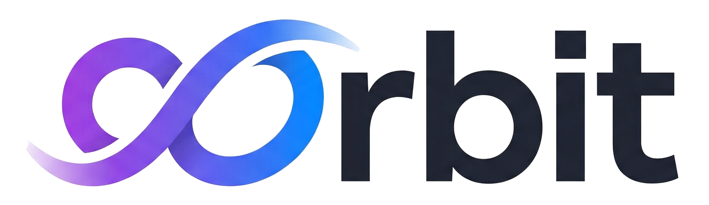

<p align="center">
  <picture>
    <source media="(prefers-color-scheme: dark)" srcset="assets/orbit_logo_white.png">
    <source media="(prefers-color-scheme: light)" srcset="assets/orbit_logo_black.png">
    
  </picture>
</p>

<h1 align="center">Orbit</h1>

<p align="center"><strong>One workbench for your Claude Code projects.</strong></p>

<p align="center"><em>Plan, execute, track, and resume - without losing state.</em></p>

<p align="center">
  
  
  
</p>

---

Orbit is the project layer for [Claude Code](https://claude.ai/code). Every orbit project gets a durable home: a plan, a living context file, and a task checklist. That state persists across sessions, survives context compaction, and reloads when you come back. On top of that foundation, orbit adds time tracking, a local analytics dashboard, autonomous execution, and a rich statusline, so multi-session work has one place to live and one place to watch.

<!-- HERO GIF: dashboard + statusline + /orbit:new flow -->

## Contents

- [Why Orbit](#why-orbit)
- [Install](#install)
- [Your First Project](#your-first-project)
- [Features](#features)
- [How Orbit compares](#how-orbit-compares)
- [Architecture](#architecture)
- [Commands](#commands)
- [Documentation](#documentation)
- [Contributing](#contributing)
- [License](#license)
- [Credits](#credits)

## Why Orbit

### Your projects keep their memory

Every orbit project lives under `~/.claude/orbit/active/<project-name>/` as three markdown files: `plan.md` (the agreed approach, locked after approval), `context.md` (your decisions, key files, gotchas, and next steps as a living document), and `tasks.md` (a hierarchical checklist with progress). Claude Code sessions end, context windows compact, but your project state stays put. Run `/orbit:go <project-name>` in any new session and orbit reloads the full state. You pick up where you left off with your plan, your decisions, and your next steps already loaded.

### Full visibility into your Claude time

Orbit tracks heartbeats while you work, aggregates them into sessions, and shows per-project, per-repo, per-day, and per-week breakdowns on a local web dashboard at `localhost:8787`. It merges orbit's own heartbeat data with Claude Code's JSONL session logs, so the picture includes time you spent in Claude sessions that were not formally tracked. You always know which projects are actually eating your cycles.

### Autonomous execution you can watch live

Orbit Auto runs project tasks in parallel with dependency-aware DAG scheduling, logs every iteration in real time, and streams execution state to the dashboard. You can watch the whole run as it happens or walk away and check the iteration log afterward. Every task, every attempt, every outcome is visible.

---

Orbit exists because no single existing tool integrates all three. See [How Orbit compares](#how-orbit-compares) for the honest breakdown against the current field.

## Install

Orbit ships in two flavors. Pick based on whether you also want the dashboard, the autonomous execution CLI, and the statusline.

### Quick install (plugin core)

This gives you the Claude Code integration: slash commands, MCP tools, lifecycle hooks, and the orbit rule file. It is enough to plan projects, track them across sessions, and resume them via `/orbit:go`. It does **not** include the dashboard, `orbit-auto` CLI, or statusline.

In Claude Code:

```
/plugin marketplace add tomerbr1/claude-orbit
/plugin install orbit@claude-orbit
```

Restart your Claude Code session. Updates flow via `/plugin update orbit@claude-orbit`.

**Requirements:** Claude Code with `uvx` available on `PATH`. The MCP server and bundled `orbit-db` are built on demand; no manual `pip install` is needed.

### Full install (plugin core + dashboard + orbit-auto + statusline)

This clones the repo and runs an interactive setup script that also installs the local web dashboard, the `orbit-auto` CLI, and the statusline. Pick this if you want to visualize your time breakdown, run autonomous task execution with live streaming, or have orbit's multi-line status block at the bottom of Claude Code.

```bash
git clone https://github.com/tomerbr1/claude-orbit.git
cd claude-orbit
./setup.sh
```

The interactive script will:

1. Register orbit in a local marketplace and install the plugin core
2. `pip install -e` the `orbit-db` package so `orbit-auto` can log execution runs to the dashboard
3. Install the Orbit Dashboard and wire it up as a background service (launchd on macOS, systemd on Linux)
4. `pip install -e` the `orbit-auto` CLI
5. Optionally install the statusline and configure health monitoring

**Requirements:** Python 3.11+, Claude Code CLI, `pip`.

**Which should I pick?** Start with the quick install if you just want the project workbench. Upgrade to the full install any time - the two paths coexist, and the full install's `setup.sh` will detect an existing plugin install and only add the missing extras.

## Your First Project

### Create it

```
/orbit:new auth-refactor
```

Orbit drops three files under `~/.claude/orbit/active/auth-refactor/`:

```
auth-refactor-plan.md      # the agreed approach, locked after you approve
auth-refactor-context.md   # living notes: decisions, key files, gotchas, next steps
auth-refactor-tasks.md     # checklist with hierarchical subtasks
```

Claude walks you through a clarifying conversation, proposes a plan, and asks for approval. Once approved, the plan file is locked and the context file starts tracking your real progress.

<!-- SCREENSHOT: /orbit:new interactive flow with file tree -->

### Work on it

Edit files, run tests, make decisions. Orbit tracks time in the background via heartbeats. When Claude Code compacts the context window, orbit's `PreCompact` hook auto-saves your current state so nothing gets lost.

If you want to checkpoint manually at any point:

```
/orbit:save
```

### Resume it tomorrow

```
/orbit:go auth-refactor
```

Orbit reloads the plan, context, and tasks files and shows you:

- Where you left off (from the context file's "Next Steps" section)
- Progress (X/Y tasks complete)
- Key architectural decisions you made
- Any gotchas you flagged

You pick up without reconstructing anything.

<!-- SCREENSHOT: /orbit:go output showing reload summary -->

### Run it autonomously

If your tasks are decomposed enough, hand the whole project to Orbit Auto:

```bash
orbit-auto auth-refactor              # parallel, 8 workers (default)
orbit-auto auth-refactor -w 12        # 12 workers
orbit-auto auth-refactor --sequential # one task at a time
orbit-auto auth-refactor --dry-run    # show execution plan without running
```

Auto runs each task in a separate Claude Code invocation, respects task dependencies, and streams iteration events to the dashboard.

<!-- SCREENSHOT: orbit-auto execution view on the dashboard with DAG -->

### Finish it

```
/orbit:done auth-refactor
```

Orbit archives the project files to `~/.claude/orbit/completed/` and records the final time and progress stats.

That is the full lifecycle. Everything else is optional depth.

## Features

### Structured project files

Every project has three markdown files: `plan`, `context`, and `tasks`. They live under `~/.claude/orbit/active/<project-name>/` and are fully human-editable. Plan captures the agreed approach and locks after approval. Context is a living document for decisions, key files, gotchas, and next steps. Tasks is a hierarchical checklist with per-item progress tracking.

<!-- SCREENSHOT: example tasks.md with checkboxes and phases -->

### Context preservation across compaction

Orbit's `PreCompact` hook auto-saves project state before Claude Code compacts the context window. When you run `/orbit:go` in a new session, the full state reloads. You never reconstruct your mental model from scratch, and you never lose a decision you made three sessions ago.

### Local analytics dashboard

A FastAPI + vanilla JS single-page app at `localhost:8787`. Shows active and completed projects with time tracking, per-repo breakdowns, hourly heatmaps, a weekly activity view, Orbit Auto execution monitoring with DAG visualization, and untracked Claude Code sessions alongside the tracked ones. Dual-database under the hood: SQLite for writes, DuckDB for analytics reads.

<!-- SCREENSHOT: dashboard home with project list and time analytics -->

### Autonomous execution with Orbit Auto

A standalone CLI that runs a project's tasks to completion in parallel. DAG scheduling respects task dependencies so dependent work waits for its prerequisites. Default eight workers, configurable with `-w N` or `--sequential`. Every iteration is logged with a timestamp, the task, the agent that ran it, and the outcome, and streamed live to the dashboard.

<!-- SCREENSHOT: orbit-auto execution view with iteration log -->

### Rich multi-line statusline

An optional terminal display showing the active project with progress fraction, git branch and status, Claude model, context usage, API limits, and last action time. OSC 8 hyperlinks open directly into the dashboard's project view from your terminal. Configurable, dark-mode friendly, low-latency.

<!-- SCREENSHOT: statusline in iTerm showing project + git + model + usage -->

### A full MCP tool suite for Claude

Orbit's MCP server exposes tools across five categories: task lifecycle, file operations, time tracking, iteration logging, and repository management. Claude uses them automatically during `/orbit:new`, `/orbit:go`, and other commands, but you can call any of them directly if you want fine-grained control.

### Lifecycle hooks

Three Claude Code hooks tie orbit directly into the session lifecycle, and they are what makes "resume tomorrow" actually work. `SessionStart` auto-detects the active project as soon as you open a terminal. `PreCompact` auto-saves your context before Claude Code compacts the window, so nothing gets lost on long sessions. `Stop` reminds you to run `/orbit:save` if you edited project files without saving. All three ship with the plugin.

## How Orbit compares

Orbit sits at the intersection of three categories that usually ship as separate tools: task management, context preservation, and execution with analytics. Here is an honest look at how orbit stacks up against the current field, grouped by category so you can jump to the tool you already know.

### vs. Task and project management

For readers who know the Anthropic Productivity Plugin or [Taskmaster AI](https://github.com/eyaltoledano/claude-task-master):

| Capability | Orbit | Productivity Plugin | Taskmaster AI |
|---|---|---|---|
| Auto task decomposition from PRD | manual (Claude-assisted) | manual | yes (dependency-aware) |
| Plan + context + tasks files per project | yes | partial (tasks only) | no |
| Resume project across sessions | yes (`/orbit:go`) | yes (workplace memory) | yes (file-based JSON) |
| Time tracking per task | yes (heartbeats) | no | no |
| Local dashboard | yes (web, analytics) | yes (HTML Kanban) | no |
| Autonomous execution | yes (orbit-auto) | no | no |
| Build/test gates on task close | no | no | yes |
| Multi-IDE support | Claude Code only | Cowork-first | 13 IDEs |
| License | MIT | Anthropic official | MIT + Commons Clause |

**Honest takeaway:** Taskmaster is stronger at PRD decomposition and at working across multiple IDEs. The Productivity Plugin is the simplest official option, with a Kanban board and workplace memory, and it ships from Anthropic. Orbit is the only one of the three with per-project time tracking, a local analytics dashboard, and autonomous execution in the same tool.

### vs. Memory and context preservation

For readers who know [claude-mem](https://github.com/thedotmack/claude-mem) or [MemPalace](https://www.mempalace.tech/):

| Capability | Orbit | claude-mem | MemPalace |
|---|---|---|---|
| Unit of organization | Projects | Sessions, entities | Wings, rooms (domains) |
| Capture mode | On compaction + `/orbit:save` | Auto per session | Auto every 15 messages |
| Storage | Human-editable markdown | AI-compressed, vector search | Structured memory palace |
| Project-scoped state | yes (plan, context, tasks) | partial | partial (wings can be projects) |
| Task checklists with progress | yes | no | no |
| Time tracking | yes | no | no |
| Dashboard | yes | partial (web viewer) | no |
| Autonomous execution | yes | no | no |
| Cross-domain recall across projects | partial | yes | yes (by design) |

**Honest takeaway:** claude-mem and MemPalace are genuinely better than orbit at cross-project memory recall. They auto-capture and query across everything you have ever worked on. Orbit is better at project-scoped state: what is the plan for *this* project, what have I decided, what is the task list, how much time have I spent, what is next. You can reasonably run orbit alongside a memory layer: MemPalace or claude-mem for long-term cross-project recall, orbit for the project you are actively building.

### vs. Execution and methodology frameworks

For readers who know [GSD](https://github.com/gsd-build/get-shit-done) or [Superpowers](https://github.com/obra/superpowers):

| Capability | Orbit | GSD (v2) | Superpowers |
|---|---|---|---|
| What it is | Project system | Autonomous execution CLI | Methodology / skills framework |
| Prescribes a methodology | no (flexible) | yes (spec, research, execute) | yes (7 phases, TDD enforced) |
| Autonomous execution | yes (DAG, parallel) | yes (sequential phases) | partial (native Task tool only) |
| Context preservation across sessions | yes (plan/context/tasks files) | partial (fresh context per task) | no |
| Time tracking | yes (per project) | partial (cost and token tracking) | no |
| Dashboard | yes | no | no |
| Statusline integration | yes | no | no |
| Token efficiency | moderate | low (fresh 200K context per task) | low (around 10x Plan mode per HN reports) |
| Composable with orbit | N/A | conflicts (both own execution) | yes (Superpowers skills inside an orbit project) |

**Honest takeaway:** GSD pioneered the "fresh context per task" pattern and remains the reference for aggressive context-rot elimination. Superpowers is a methodology, not a system, and it **composes with orbit**: you can use Superpowers skills inside an orbit-managed project to get TDD enforcement and structured planning on top of orbit's project state and time tracking. Orbit's unique contribution is integrating autonomous execution with persistent project state and analytics in a single tool.

### vs. native Claude Code features

For readers coming from [Claude Code Agent Teams](https://code.claude.com/docs/en/agent-teams), the native statusline, or Claude's built-in analytics:

| Capability | Orbit | Agent Teams | Native Statusline | Native Analytics |
|---|---|---|---|---|
| Status | Stable | Experimental (v2.1.32+) | Stable | GA (Teams / Enterprise) |
| Zero install | no (plugin) | yes | yes | yes |
| Persistent project state between invocations | yes (plan, context, tasks files) | no | N/A | no |
| Task list with dependencies | yes (DAG-scheduled) | yes (flat, shared) | N/A | no |
| Multi-session orchestration | orbit-auto (parallel, DAG) | yes (2 to 16 sessions) | N/A | no |
| Time tracking per project | yes (heartbeats, JSONL merge) | no | no | no (contribution metrics only) |
| Local dashboard with analytics | yes | no | N/A | cloud-only |
| Project-aware statusline | yes (OSC 8 deep links into dashboard) | no | generic (model, tokens, git) | N/A |
| Self-hosted | yes | yes | yes | no |
| Available to individual users | yes | yes | yes | Teams / Enterprise plans only |

**Honest takeaway:** Agent Teams is the most direct native competitor for the "run Claude autonomously across multiple sessions" use case. Its strengths are zero install and improving with every Claude Code release - that is a real risk to orbit over time. Its current limits: it is still experimental, it has no persistent state between invocations, no dashboard, no time tracking, no per-task analytics, and a 16-session ceiling. Native analytics is GitHub-scoped, cloud-hosted, and only on paid Teams or Enterprise plans. Orbit's statusline is project-aware with OSC 8 deep links into the local dashboard; the native statusline is a generic token/model/git display. Today orbit wins on persistence, analytics, and the integrated experience. If Agent Teams adds persistent state and a dashboard, that story gets harder - tracked as a known long-term risk.

### When to use something else

Orbit is not the right answer for every workflow. Use one of these instead if:

- **You want PRD to task decomposition with multi-IDE support:** [Taskmaster AI](https://github.com/eyaltoledano/claude-task-master)
- **You want a methodology that enforces TDD and structured planning:** [Superpowers](https://github.com/obra/superpowers) (and you can use it alongside orbit)
- **You want cross-domain memory that outlives any single project:** [MemPalace](https://www.mempalace.tech/) or [claude-mem](https://github.com/thedotmack/claude-mem)
- **You want aggressive context-rot elimination with fresh contexts per task:** [GSD / GSD-2](https://github.com/gsd-build/get-shit-done)
- **You want Anthropic's official Kanban and workplace memory with zero setup:** [Productivity Plugin](https://claude.com/plugins/productivity)
- **You want zero-install native multi-session orchestration with no persistent state between runs:** [Claude Code Agent Teams](https://code.claude.com/docs/en/agent-teams) (experimental, ships with Claude Code)
- **You want all of the above integrated into one workbench for a specific project:** Orbit

## Architecture

Orbit ships as a Claude Code plugin with an MCP server, plus four standalone components you can install or skip independently:

| Component | Purpose | Installs via |
|---|---|---|
| `orbit` plugin | Slash commands, MCP tools, lifecycle hooks | Claude Code plugin marketplace |
| `orbit-db` | SQLite + DuckDB layer at `~/.claude/tasks.db` | `pip install orbit-db` |
| `orbit-auto` | Autonomous execution CLI | `pip install orbit-auto` |
| `orbit-dashboard` | Local FastAPI + vanilla JS web UI at `localhost:8787` | Runs as a launchd/systemd service |
| `statusline` | Optional multi-line terminal display | Symlinked into `~/.claude/scripts/` |

<!-- DIAGRAM: plugin + MCP server + db + auto + dashboard + statusline component graph -->

The plugin is the minimum viable install. Everything else is opt-in, and each component can be used on its own if you only need that piece. `orbit-db` and `orbit-auto` are pip-installable packages you can depend on from your own scripts.

### Data storage

| Path | Purpose |
|---|---|
| `~/.claude/orbit/active/` | Active project files (plan, context, tasks) |
| `~/.claude/orbit/completed/` | Archived completed projects |
| `~/.claude/tasks.db` | SQLite database (task tracking, time heartbeats, Claude session cache) |
| `~/.claude/tasks.duckdb` | DuckDB analytics (synced from SQLite, dashboard reads) |

## Commands

| Command | Description |
|---------|-------------|
| `/orbit:new` | Create a new project with plan, context, and task files |
| `/orbit:go` | Resume work on an active project |
| `/orbit:save` | Persist progress before session end or compaction |
| `/orbit:done` | Mark a project as completed and archive |
| `/orbit:prompts` | Regenerate optimized prompts for subtasks |
| `/orbit:mode` | Assign workflow mode (interactive or autonomous) to tasks |

## Documentation

Deep dives for each component live in `docs/`:

- [**Architecture**](docs/architecture.md) - component boundaries, database schema, extension points
- [**Dashboard**](docs/dashboard.md) - screens, time accounting, API reference, customization
- [**Orbit Auto**](docs/orbit-auto.md) - sequential vs parallel, DAG scheduling, learning tags, worker model, review stages
- [**MCP Tools**](docs/mcp-tools.md) - all 30 tools by module, error handling, extension patterns
- [**Statusline**](docs/statusline.md) - lines explained, env vars, customization, performance notes
- [**Hooks**](docs/hooks.md) - SessionStart, UserPromptSubmit, PreCompact, Stop, state files, adding new hooks

## Contributing

Pull requests welcome. Development setup, testing conventions, and PR standards will live in `CONTRIBUTING.md` *(coming soon)*.

## License

MIT. See [`LICENSE`](LICENSE).

## Credits

Orbit stands on the shoulders of the tools that came before it. Direct inspiration and honest competition: [GSD](https://github.com/gsd-build/get-shit-done), [claude-mem](https://github.com/thedotmack/claude-mem), [MemPalace](https://www.mempalace.tech/), [Taskmaster AI](https://github.com/eyaltoledano/claude-task-master), [Superpowers](https://github.com/obra/superpowers), and the [Anthropic Productivity Plugin](https://claude.com/plugins/productivity). Each of them solves a real slice of the multi-session Claude Code problem, and orbit would not exist without the paths they blazed.
